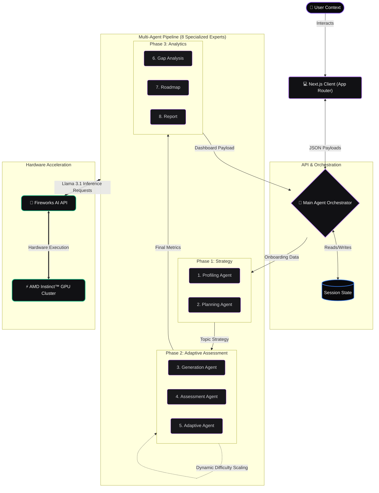

<div align="center">
  
  
  # Kaizen AI (改善)

  **Intelligent Multi-Agent Self-Assessment & Continuous Learning Platform**

  *Built for AMD Developer Hackathon ACT II — Track 3: Unicorn Track 🦄*

  [](https://nextjs.org)
  [](https://fireworks.ai)
  [](https://developer.amd.com)
  [](https://www.typescriptlang.org/)
  [](https://www.framer.com/motion/)

  <p align="center">
    <a href="#about">About</a> •
    <a href="#features">Features</a> •
    <a href="#architecture">Architecture</a> •
    <a href="#tech-stack">Tech Stack</a> •
    <a href="#getting-started">Getting Started</a>
  </p>
</div>

---

## 🦄 About

**Kaizen (改善)** is the Japanese philosophy of continuous improvement through small, consistent steps.

**Kaizen AI** brings this philosophy to technical skill development. Instead of generic leetcode questions or static multiple-choice tests, Kaizen AI deploys **8 specialized AI agents** powered by **Fireworks AI on AMD GPUs** to deliver an adaptive, conversational assessment experience. 

It finds exactly where your knowledge breaks down, explains your gaps in real-time, and builds a customized learning roadmap to get you to your next role.

---

## ✨ Production-Grade Features

- **Continuous Scroll Assessment**: Experience a premium, conversational UI. Previous questions lock in a read-only state while the AI evaluates your answer in real-time. Click "Generate Next Question" and watch the interface smoothly auto-scroll to your next adaptive challenge.
- **Real-Time Difficulty Scaling**: Breeze through? The AI scales up the complexity to find your ceiling. Stumble? It scales down to find your foundation.
- **Context-Aware Code Evaluation**: Write code in-browser. The Evaluation Agent reads your logic, identifies missed edge cases, and explains time/space complexity.
- **Notion-Style Analytical Dashboard**: Beautiful, actionable reports featuring a glowing Score Ring, Radar Charts of your skills, prioritized Skill Gaps, and a Phased Learning Roadmap.
- **Massive Vertical Rhythm Design**: A strictly Apple-inspired, YC-startup aesthetic using deep dark themes (`#09090B`), strict glassmorphism, and seamless Framer Motion animations.

---

## 🧠 The 8-Agent Architecture

At the core of Kaizen AI is an orchestration engine that seamlessly routes data between 8 highly specialized LLM agents.

| Agent | Role |
|---|---|
| 👤 **User Profiling Agent** | Analyzes background and creates a tailored assessment strategy. |
| 📋 **Question Planning Agent** | Selects optimal topics, formats, and difficulty levels. |
| ⚡ **Question Generation Agent** | Dynamically creates adaptive questions in real-time via Fireworks AI. |
| 🎯 **Adaptive Difficulty Agent** | Adjusts complexity instantly based on real-time evaluation scores. |
| 🧠 **Assessment Agent** | Evaluates reasoning, syntax, and clarity, providing actionable feedback. |
| 📊 **Skill Gap Analysis Agent** | Maps strengths and identifies high-priority improvement areas. |
| 🗺️ **Recommendation Agent** | Generates personalized, step-by-step learning roadmaps. |
| 📈 **Report Generation Agent** | Synthesizes all data into the final Notion-style analytics dashboard. |



---

## 🛠️ Tech Stack

- **Frontend Core**: Next.js 14 (App Router), React 18, TypeScript
- **AI Infrastructure**: Fireworks AI (Llama 3.1 70B & 405B Models)
- **Hardware Acceleration**: AMD Instinct™ GPUs (via Fireworks AI infrastructure)
- **Styling**: Tailwind CSS (Custom Dark Mode Design System)
- **Animations**: Framer Motion
- **Data Visualization**: Recharts
- **Icons**: Lucide React

---

## 🚀 Getting Started

### Prerequisites
- Node.js 20+
- A [Fireworks AI API key](https://fireworks.ai)

### Local Development

1. **Clone the repository**
   ```bash
   git clone https://github.com/karthikj5453/Kaizen-AI.git
   cd kaizen-ai
   ```

2. **Install dependencies**
   ```bash
   npm install
   ```

3. **Environment Setup**
   Create a `.env.local` file in the root directory:
   ```env
   FIREWORKS_API_KEY=your_fireworks_api_key_here
   ```

4. **Start the Development Server**
   ```bash
   npm run dev
   ```
   *Open [http://localhost:3000](http://localhost:3000) to view the application.*

---

## 🐳 Docker Deployment

```bash
# Build the Docker image
docker build -t kaizen-ai .

# Run the container
docker run -p 3000:3000 -e FIREWORKS_API_KEY=your_key_here kaizen-ai
```

---

## 🏆 AMD Developer Hackathon ACT II Alignment

This project is submitted for **Track 3 — Unicorn Track**.

| Criterion | Kaizen AI Implementation |
|---|---|
| **Creativity & Originality** | Unique 8-agent orchestration pipeline; novel implementation of a conversational, continuous-scroll assessment UI instead of static forms. |
| **Product/Market Potential** | A production-ready SaaS MVP that solves real pain points in technical interviewing and upskilling, directly competing with platforms like HackerRank AI and Interviewing.io. |
| **Completeness** | Flawless end-to-end execution: Immersive Landing Page → Interactive Onboarding → Adaptive Assessment Engine → Actionable Analytics Dashboard. |
| **Use of AMD Platforms** | High-performance, low-latency AI inference powered exclusively by Fireworks AI running on AMD hardware, crucial for real-time evaluation and continuous scrolling. |

---

<div align="center">
  <i>"Small improvements compound over time."</i><br/>
  <b>Built for the AMD Hackathon</b>
</div>
